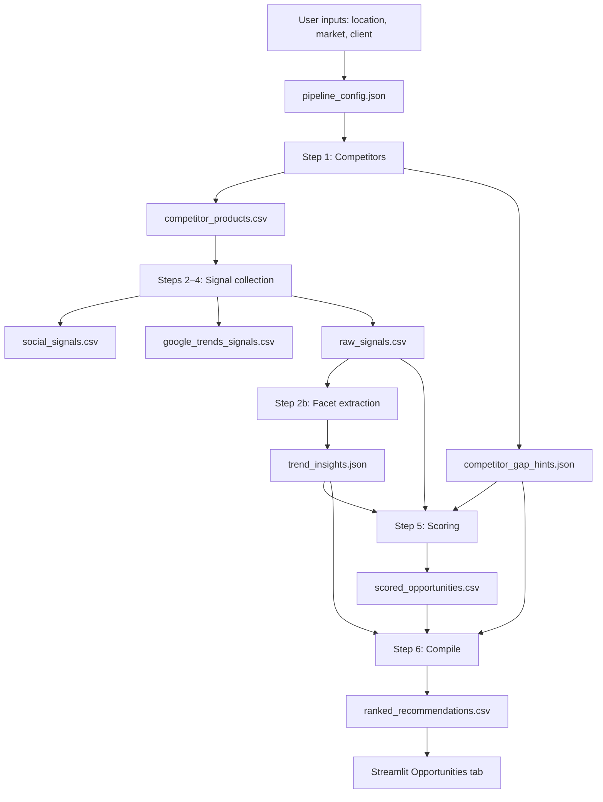

# Pipeline Summary

Zenline Opportunity Scout turns noisy market signals into ranked retail opportunities for a Swiss outdoor client (e.g. Decathlon). Every step writes inspectable files so judges can trace **trend → evidence → score → recommendation**.

## How to run

```bash
# UI (recommended for demo)
streamlit run app/streamlit_app.py

# Or full pipeline in one call
python3 -c "from app.pipeline_runner import run_pipeline; run_pipeline('Switzerland', 'Swiss outdoor', 'Decathlon')"
```

Optional: Claude API key in the Streamlit sidebar enriches config and recommendations. Scoring works without it.

---

## End-to-end flow



**What you see at the end:** ranked cards in the UI, each with **Trend**, **Why**, **Evidence** (bullets + URLs), and collapsible **Details** (action, confidence, risks).

---

## The six steps

### Step 0 — Configuration

**What happens:** Inputs (Switzerland, Swiss outdoor, Decathlon, price band, time horizon) merge with the vertical preset (keywords, competitors, materials to watch). Optional Claude call refines keywords and competitors.

**Evidence:** [`pipeline_config.json`](../pipeline_config.json) — full run inputs, `time_windows`, `trends_keywords_from_social` (after step 2), data-source flags (`bundled` vs `live`).

---

### Step 1 — Competitor assortment

**What happens:** Loads ~4,500 products from the offline catalog [`competitors/competitor_products.csv`](../competitors/competitor_products.csv) (scraped via [`competitors/scrape_products.py`](../competitors/scrape_products.py) and [`competitors/extracted_websites.csv`](../competitors/extracted_websites.csv)). Computes which brands/categories appear at rivals but not the client.

**Outputs:**

| File | Role |
|------|------|
| [`competitor_products.csv`](../competitor_products.csv) | Normalized competitor + client product rows (`brand`, `material`, `feature`, `product_type`, `is_client`) |
| [`competitor_gap_hints.json`](../competitor_gap_hints.json) | `gap_brands`, `gap_categories`, summary counts |

**Feeds forward:** Product titles → `product_seeds` in config → YouTube queries and Google Trends keywords.

---

### Steps 2–4 — Signal collection

Three layers are collected, written to **separate CSVs**, then merged.

#### 2a — Social (YouTube-led)

**Sources:** YouTube (primary), Reddit (often blocked → mock), TikTok (simulated).

**Flow:**
1. YouTube videos collected (bundled or live API with `YOUTUBE_API_KEY`).
2. Titles and search queries → keyword list for Google Trends.

**Evidence:**

| File | Contents |
|------|----------|
| [`social_signals.csv`](../social_signals.csv) | All social rows from the latest run |
| [`data/bundled/youtube_signals.csv`](../data/bundled/youtube_signals.csv) | Offline YouTube snapshot (demo mode) |
| [`data/bundled/social_signals.csv`](../data/bundled/social_signals.csv) | Offline full social snapshot |

#### 2b — Regional context

**Sources:** Open-Meteo (weather, UV), Nager.Date (holidays), exchangerate.host (FX), GearJunkie / Outside RSS.

**Evidence:** [`data/bundled/regional_signals.csv`](../data/bundled/regional_signals.csv) (bundled); rows appear in `raw_signals.csv`.

#### 2c — Google Trends

**Sources:** pytrends (multi-geo: global, CH, US, JP; momentum + seasonal windows). Keywords come from config **plus** social-derived terms (`trends_keywords_from_social` in config).

**Evidence:**

| File | Contents |
|------|----------|
| [`google_trends_signals.csv`](../google_trends_signals.csv) | Trends-only rows from latest run |
| [`data/bundled/google_trends_signals.csv`](../data/bundled/google_trends_signals.csv) | Offline trends snapshot |
| [`cache/trends_*.json`](../cache/) | Raw interest-over-time series per keyword/geo/window |

#### Merge

**Evidence:** [`raw_signals.csv`](../raw_signals.csv) — **master evidence file**: social + regional + trends + all competitor product rows, deduplicated.

Each row follows [`docs/data-contract.md`](data-contract.md): `source`, `market`, `keyword`, `signal_name`, `signal_type`, `url`, `observed_at`, etc.

---

### Step 2b — Trend facet extraction

**What happens:** Scans `raw_signals.csv` for recurring themes → materials, features, aesthetics, colours, product mentions. Rule-based by default; Claude optional.

**Evidence:** [`trend_insights.json`](../trend_insights.json) — facet lists + `provenance` (URLs per facet) + `extraction_method`.

---

### Step 5 — Scoring

**What happens:** Clusters related rows (e.g. all YouTube + Trends rows for “backpack”), scores each cluster on six dimensions, assigns confidence and workflow (`monitor` / `test` / `buy` / `launch`).

**Formula:** Documented in [`evidence/METHODOLOGY.md`](../evidence/METHODOLOGY.md).

| Dimension | Weight | Example evidence |
|-----------|--------|------------------|
| momentum | 25% | Google Trends velocity |
| early_market | 20% | US/JP stronger than CH |
| innovation | 15% | Facets, YouTube, RSS |
| gap | 25% | Matches `competitor_gap_hints.json` |
| commercial_fit | 10% | Category overlap |
| source_diversity | 5% | Multiple live sources |

Mock-only clusters are **capped at 0.35**; `notes` column flags `contains mock/simulated evidence`.

**Evidence:** [`scored_opportunities.csv`](../scored_opportunities.csv) — every signal row with `signal_score`, `confidence`, and explainable `notes` (dimension breakdown).

---

### Step 6 — Recommendations

**What happens:** Top scored signals + facets + gap hints → 4–5 ranked business opportunities (product, material, brand, aesthetic, merchandising, etc.). Claude writes narrative; rule-based fallback if API unavailable.

**Evidence:** [`ranked_recommendations.csv`](../ranked_recommendations.csv)

| Column | Meaning |
|--------|---------|
| `opportunity` | The trend / opportunity name |
| `evidence_summary` | Why + evidence bullets (shown as **Why** / **Evidence** in UI) |
| `evidence_urls` | Source links (YouTube, Trends, etc.) |
| `transferability` | DACH/Swiss fit |
| `recommended_action` | What to test, buy, or launch |
| `confidence` | high / medium / low |
| `risks` | Limitations and missing proof |
| `competitor_gap` | Assortment gap context |

---

## Evidence trail (judge checklist)

To audit recommendation **#1** in the UI:

1. Open **`ranked_recommendations.csv`** — read `evidence_summary` and `evidence_urls`.
2. Open **`scored_opportunities.csv`** — search for those URLs; check `signal_score` and `notes`.
3. Open **`raw_signals.csv`** — see the original signal rows (`source`, `signal_name`, `url`).
4. Open **`trend_insights.json`** — see which facets (e.g. `gore-tex`, `gorpcore`) were extracted and their provenance URLs.
5. Open **`competitor_gap_hints.json`** — verify gap brands cited in `competitor_gap`.
6. Read **`evidence/METHODOLOGY.md`** — scoring formula and source trust levels.

---

## Bundled vs live data

Default demo mode uses **bundled** CSVs (no API keys, reproducible for judges):

| Setting in `pipeline_config.json` | Effect |
|-----------------------------------|--------|
| `competitor_data_source: bundled` | `competitors/competitor_products.csv` |
| `youtube_data_source: bundled` | `data/bundled/youtube_signals.csv` |
| `regional_data_source: bundled` | `data/bundled/regional_signals.csv` |
| `trends_data_source: bundled` | `data/bundled/google_trends_signals.csv` |

Refresh bundled files from live APIs:

```bash
YOUTUBE_API_KEY=your_key python3 scripts/snapshot_bundled_signals.py --live
```

**Note:** Writes currently **replace** CSVs on each run (not append). Re-snapshot to grow the offline catalog.

---

## What counts as evidence

| Strength | Source types | How labeled |
|----------|--------------|-------------|
| **High** | Competitor catalog, live YouTube, Open-Meteo, RSS, Shopify scrapes | `source` without `_mock` / `_fallback` |
| **Medium** | Google Trends (pytrends), bundled snapshots | `google_trends_*`; `notes` include window/geo |
| **Low / simulated** | Reddit block fallback, TikTok mock, Trends rate-limit mock | `*_fallback_mock`, `tiktok_mock`; score-capped |

We **do not** claim weak signals are proof — they surface as low confidence or `monitor` workflow.

---

## Known limitations

- **No strict relevance filter** between YouTube/Trends and competitor catalog (seeds influence queries but do not gate results).
- **Reddit** often 403-blocked; **TikTok** is simulated.
- **Google Trends** can rate-limit; bundled cache avoids this in demos.
- **LLM steps** (config, facets, compile) optional; deterministic scoring always runs.

---

## File index (quick reference)

| File | Step |
|------|------|
| `pipeline_config.json` | 0 |
| `competitors/competitor_products.csv` | 1 (source catalog) |
| `competitor_products.csv` | 1 |
| `competitor_gap_hints.json` | 1 |
| `social_signals.csv` | 2a |
| `data/bundled/youtube_signals.csv` | 2a (offline) |
| `google_trends_signals.csv` | 2c |
| `raw_signals.csv` | 2 merge |
| `trend_insights.json` | 2b |
| `scored_opportunities.csv` | 5 |
| `ranked_recommendations.csv` | 6 ← **final output** |
